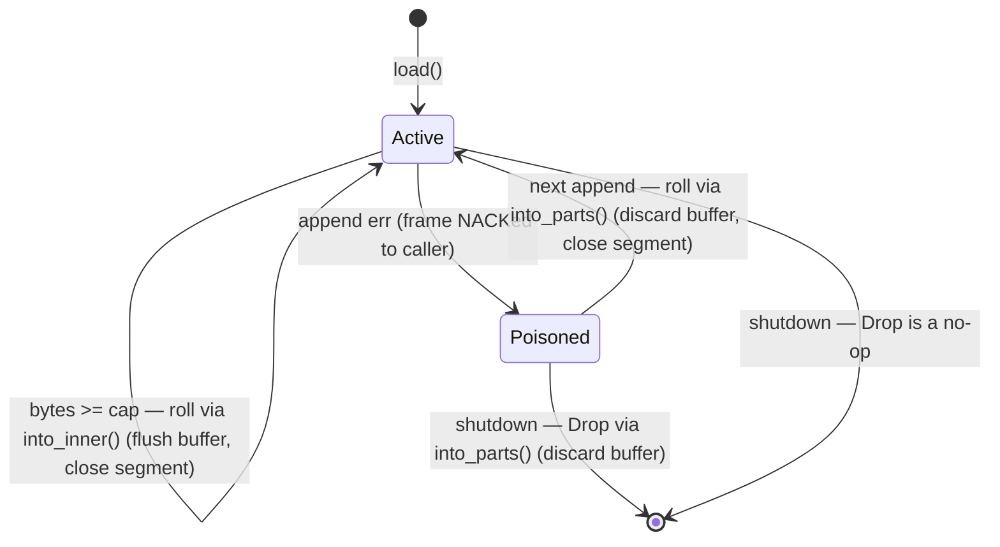

# fakestream — write-ahead log design

The WAL is the record-durability half of `--persist` (the manifest holds stream definitions and
the sequence high-water; see `DESIGN.md`). It is an **append-only, segmented log**: records are
appended as length-framed frames, segments roll at a size cap, and a whole segment is deleted once
every record in it is past retention — there is never a full-store serialization.

This document describes the crash-consistency contract the WAL upholds, the mechanisms that enforce
it, and the failure modes each mechanism closes.

## On-disk layout

```
<persist_dir>/
├── manifest.json                 stream defs + global seq high-water (see DESIGN.md)
└── wal/
    ├── seg-0000000001.log        closed segment  ┐
    ├── seg-0000000002.log        closed segment  │ drop candidates (oldest first)
    ├── seg-0000000003.log        closed segment  ┘
    └── seg-0000000004.log        active segment   (highest id; only this one is appended to)
```

Each segment is a flat sequence of frames:

```
frame := [ u64 length, little-endian ] [ postcard(FrameRef) ]
FrameRef := { s: stream, sh: shard_id, r: record }
                                        └─ record = { seq, partition_key, data, timestamp_ms }

┌───────────── 8 bytes ─────────────┬──────────── `length` bytes ────────────┐
│ body length (LE u64)              │ postcard body                          │  … next frame →
└───────────────────────────────────┴─────────────────────────────────────────┘
```

The 8-byte length prefix is what makes a **crash-torn trailing frame detectable**: on replay, a
length that runs past end-of-file (or a body that fails to decode) marks the safe truncation point.
`decode_segment` walks frames until it hits one, returning the good entries plus that byte offset.

Frames are serialized with **postcard**. (The WAL previously used bincode; bincode 3.0.0 ships as a
`compile_error!` tombstone, so it was migrated to the maintained postcard format — the frame layout
is otherwise identical.)

## The durability contract

The WAL, together with the put path in `ops.rs` and the maintenance loop in `main.rs`, upholds
these invariants:

1. **An ack implies an on-disk frame.** A `PutRecord`/`PutRecords` success is returned only after
   the record's frame reached the OS write buffer. A failed append rolls the in-memory record back
   and returns `InternalFailure` (single) or a per-record batch failure.
2. **Valid frames never sit behind garbage.** A failed write may leave a torn frame at a segment's
   tail; the next append always starts a fresh segment, so no readable frame is ever stranded after
   an unreadable one.
3. **A NACKed record never resurrects.** A frame the client was told *failed* is discarded, never
   flushed to disk on a later roll or on shutdown.
4. **GC is crash-safe against manifest state.** A segment is dropped only after the manifest that
   still references its streams has been saved; a crash mid-GC can never recover a stream definition
   whose records were already deleted.
5. **Retention is per-stream.** A keep-forever stream cannot pin a segment whose only other records
   belong to a long-expired stream.

Durability boundary: writes are `flush`ed to the **OS buffer**, not `fsync`ed. Records survive a
process crash but not a power loss; the only loss window is records appended since the last
maintenance tick. This is deliberate — fakestream is a local dev emulator, and fsync-per-append
would dominate its cost.

## Append and roll — the segment state machine

`append` rolls first if the active segment is full **or poisoned**, then writes one frame. A write
error poisons the segment and is reported to the caller.



The critical distinction is **`into_inner()` vs `into_parts()`** when a roll closes the active
writer:

- **Clean roll** (`into_inner`): flush the `BufWriter`'s buffer to the file, then close it. Normal
  case — the buffered bytes are good records.
- **Poisoned roll / poisoned Drop** (`into_parts`): hand back the raw file **without flushing**,
  dropping the buffer. This is the mechanism behind invariant 3: when `write_all` succeeded but the
  following `flush` failed, the NACKed frame is still buffered. Flushing it — which a normal roll or
  the `BufWriter`'s own `Drop` would do — would append a record the client was told had failed onto
  the closing segment's tail, where replay would pick it up. `into_parts` discards it instead.

Because `Drop` needs to `take()` the writer to discard its buffer, the active writer is held as
`Option<BufWriter<File>>` rather than a bare `BufWriter<File>`.

## Retention and segment GC

Each closed `Segment` records a **per-stream** newest timestamp: `max_ts: HashMap<stream, u128>`.
A segment is droppable only when *every* stream it holds records for agrees:

```
segment_expired(seg) =
    for every (stream, newest_ts) in seg.max_ts:
        retentions[stream] is absent      → droppable  (stream deleted; won't replay)
        retentions[stream] == 0           → PINNED     (keep forever)
        now - newest_ts > retention * 1000 → droppable  (outlived finite retention)
    → segment is droppable iff all streams are droppable
```

`drop_expired` never touches the active segment and is resilient to removal failures:

| `remove_file` result | action                                                          |
|----------------------|-----------------------------------------------------------------|
| `Ok`                 | count as dropped                                                |
| `NotFound`           | count as dropped — entry is stale, stop retrying it every cycle |
| other error          | keep the segment tracked (a drop candidate next cycle); record the first error, keep processing the rest, return it at the end |

This prevents both a disk leak (a genuinely-failed removal stays tracked instead of being forgotten)
and a wedged closed-list (an already-gone file doesn't get retried forever).

## Maintenance integration — ordering and locking

The maintenance thread drives GC via `persist_and_gc` on every `--persist-interval` tick:

```
read-lock(store)                        ← held across the ENTIRE pass
  manifest::save(dir, store)
    └─ on error: log and RETURN (skip GC entirely)
  retentions = store.stream_retentions()
  lock(wal).drop_expired(now, retentions)
release-lock(store)
```

Two ordering rules matter:

- **Manifest before drop.** If the manifest save fails, GC is skipped. Otherwise the on-disk
  manifest could still list a stream that was deleted in memory, and dropping that stream's segments
  would let a crash recover the stream definition with its records gone (invariant 4).
- **One store read lock across snapshot *and* drop.** Taking the retention snapshot and then
  dropping segments under a single lock stops a concurrent `CreateStream` + roll from slipping a
  fresh closed segment past a stale snapshot and having GC delete its already-acked records. The
  lock order is **store-then-wal**, matching every other path, so this cannot deadlock.

## Replay

`Wal::load` reads `seg-*.log` in id order and decodes each:

- **Last (active) segment**, torn tail → **truncate the file** to the last good byte, so future
  appends stay clean.
- **Closed segment**, corruption mid-file → **log a warning and continue**; frames after the corrupt
  point in that one segment are unreadable, but every later segment still replays. Surfacing it beats
  silently dropping bytes.

The returned entries feed `Store::restore_record`; `main.rs` then bumps the seq counter to the
replayed high-water and trims expired records. Two replay-correctness rules live in the store/manifest
layer and complete the picture: records predating their stream's creation are dropped on replay, and a
delete/recreate boundary is guarded by a **persisted seq floor** (rather than wall-clock time) so it
survives a restart.

## Failure modes closed

The append-only segmented core was always present; the hardening below is what makes the contract
above hold under partial writes, crashes, and concurrent maintenance.

| Failure mode (previous behavior)                                                             | Fix                                                                 |
|----------------------------------------------------------------------------------------------|---------------------------------------------------------------------|
| A put was acked even when its WAL append errored                                             | Fail the put; roll the in-memory record back                        |
| A record that vanished after `put` was still acked as durable                                | Treat the missing record as a durability failure, log and reject    |
| A failed write left partial bytes; the next append wrote after them, stranding later frames  | `poisoned` flag forces a fresh segment before the next append       |
| A NACKed frame buffered before a flush failure was flushed on the next roll or on shutdown    | `into_parts()` discards the buffer on poisoned roll and poisoned Drop |
| One keep-forever stream pinned segments holding only another stream's long-expired records    | Per-stream `max_ts`; every stream must agree before a drop          |
| The first `remove_file` error aborted GC and re-tried already-gone files forever             | Tolerate `NotFound`, keep genuinely-failed segments, process the rest |
| Corruption inside a closed segment silently hid the bytes after it                           | Truncate-repair only the active tail; log closed-segment corruption |
| GC could delete records the crash-recoverable manifest still referenced                      | Save the manifest before dropping; skip GC if the save fails        |
| A concurrent `CreateStream` + roll could have its records GC'd against a stale snapshot        | Hold the store read lock across snapshot and drop                   |
